# 🐾 AFHQ Diffusion: A DDPM on Animal Faces

A clean, reproducible PyTorch implementation of a **Denoising Diffusion Probabilistic Model (DDPM)** trained on **AFHQ** (cats / dogs / wildlife). This repo includes:

- 4-level U-Net (2× ResBlocks/level) w/ linear attention, sinusoidal time-embedding FiLM-fused into all blocks.
- **Cosine** noise schedule (Nichol & Dhariwal, 2021)
- Forward & reverse diffusion visualizations
- Periodic **FID** via `clean-fid`
- Weights & Biases logging (loss, FID, sample grids)

---

## Task

Given 36×36 AFHQ images, learn a generative model that:
- Denoises Gaussian noise into images through a reverse Markov chain
- Visualizes the forward corruption and reverse denoising trajectories
- Tracks training via loss, FID, and sample grids

---

## Dataset

- **Source**: AFHQ dataset (**[`LINK`](https://github.com/clovaai/stargan-v2/blob/master/README.md#animal-faces-hq-dataset-afhq)**).
- **Resolution**: train at 36×36.
- **Folder layout**

```
data/
  train/
    cat/*.jpg
    dog/*.jpg
    wild/*.jpg
  val/
    cat/*.jpg
    dog/*.jpg
    wild/*.jpg
```

Choose split with `--data_class {cat|dog|wild|all}`.

---

## Model & Method

### U‑Net backbone (see `unet.py`)
- **4-level Encoder–decoder** with 2 ResNet blocks per level and skip connections for feature reuse and sharp spatial details.
- Each stage uses **ResNet blocks** (weight‑standardized conv → group norm → SiLU).
- **Time embedding**: sinusoidal t‑embedding → 2‑layer MLP → FiLM‑style (scale, shift) into blocks.
- **Attention**: lightweight / linear attention at multiple resolutions for long‑range interactions.
- **Output**: predicts noise `eps = ε_θ(x_t, t)` with 3 channels (RGB).


### Noise schedule (cosine)
We precompute per‑step coefficients using the **cosine** schedule and cache them as buffers:

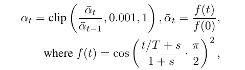

Saved buffers in `diffusion.py`: `alpha_t`, `alpha_bar`, `sqrt_alpha_bar`, `sqrt_one_minus_alpha_bar`, and the posterior variance.

### Forward process q(x_t | x_0)
Adds Gaussian noise in T steps:

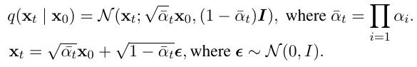

Implemented by `q_sample`.

### Objective (noise prediction)
Train the network to predict the noise that produced x_t:

```
Loss = L1( ε_θ(x_t, t), eps )
```

L1 is stable and yields sharp results.

### Training 

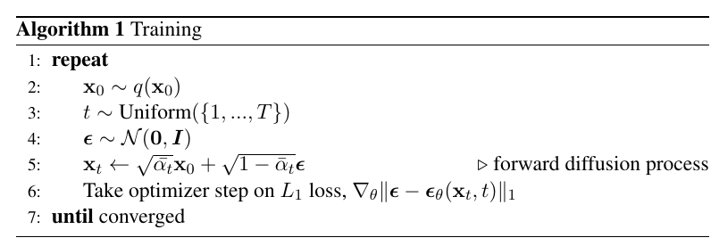

### Reverse process p_θ(x_{t-1} | x_t)
Reconstruct a proxy `x0_hat` from the predicted noise:

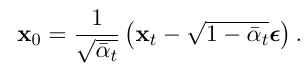

Then sample from the posterior (Gaussian) with mean and variance:

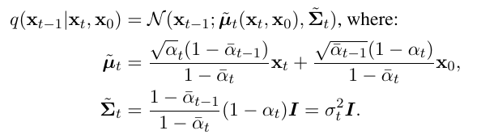

Implemented in `p_sample`.

### Sampling
1. Draw `x_T ~ N(0, I)`.
2. For `t = T, ..., 1`:
   - predict `ε_θ(x_t, t)`, form `x0_hat`, compute `(mu_t, sigma_t^2)`, then sample `x_{t-1}`.
3. Clamp to `[-1, 1]` and unnormalize to `[0, 1]`.

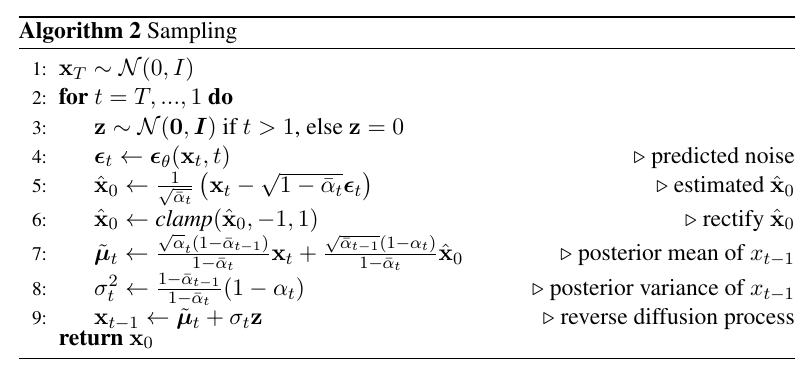

---

## Evaluation: Fréchet Inception Distance (FID)

**What it measures.** FID compares the distribution of **generated** images to the distribution of **real** images in a semantic feature space (Inception-V3 pool3, 2048-D). Each set of features is modeled as a Gaussian; FID is the Fréchet distance between those Gaussians. **Lower is better** (0 means identical distributions).

**Definition.**

$$\mathrm{FID}(\mathcal{X}_r,\mathcal{X}_g) = \lVert \mu_r-\mu_g \rVert_2^2 + \mathrm{Tr}\left(\Sigma_r + \Sigma_g - 2\,(\Sigma_r \Sigma_g)^{1/2}\right)$$

where $\mu_r,\Sigma_r$ (real) and $\mu_g,\Sigma_g$ (generated) are the mean and covariance of 2048-D Inception features.

**Implementation.** We use **[`clean-fid`](https://github.com/GaParmar/clean-fid)** to standardize preprocessing and feature extraction. In this repo:
- Enable FID with `--fid` and set `--save_and_sample_every <K>`.
- Every \(K\) steps the trainer saves a batch of generated samples to `results/<run>/sample_ddpm_*` and (if absent) creates a resized `val/` folder from the training split to match image size.
- The scalar `fid` is logged to Weights & Biases (if enabled).

---

## Install

```bash
python -m venv .venv && source .venv/bin/activate
pip install -r requirements.txt
# or:
# pip install torch torchvision clean-fid wandb tqdm pillow einops
wandb login   # optional, for online logging
```
---

## Experiments (reproducible, independent)

> Tip (multi‑GPU): pick one GPU  
> `export CUDA_VISIBLE_DEVICES=0`

### A) Short warm‑up — loss dynamics & early samples

Quick sanity‑check; expect **blurry cats** after a few hundred steps.

```bash
python main.py \
  --train_steps 1000 \
  --save_and_sample_every 100 \
  --data_class cat \
  --data_path ./data/train \
  --image_size 32 --batch_size 32 \
  --learning_rate 1e-3 --time_steps 50 --unet_dim 16 \
  --save_folder ./results/exp_warmup
```

**Where to view results**
- Sample grids: `results/exp_warmup/sample_*.png`
- W&B: `loss`, `img` (if logged in)

---

### B) Track FID over training

Compute **FID** via `clean-fid` every 100 steps.

```bash
python main.py \
  --train_steps 1000 \
  --save_and_sample_every 100 \
  --fid \
  --data_class cat \
  --data_path ./data/train \
  --image_size 32 --batch_size 32 \
  --learning_rate 1e-3 --time_steps 50 --unet_dim 16 \
  --save_folder ./results/exp_fid

python main.py \
  --train_steps 10000 \
  --save_and_sample_every 100 \
  --fid \
  --data_class cat \
  --data_path ./data/train \
  --image_size 32 --batch_size 32 \
  --learning_rate 1e-3 --time_steps 50 --unet_dim 16 \
  --save_folder ./results/exp_fid
```

**Where to view results**
- Sample batches: `results/exp_fid/sample_ddpm_*/sample_*.png`
- FID curve: W&B panel `fid` (plus console logs)

> Note: the trainer auto‑creates a resized `val/` set (mirroring train) when needed for FID.

---

### C) Longer training for sharper samples (10k iters)

Pushes detail and coherence.

```bash
python main.py \
  --train_steps 10000 \
  --save_and_sample_every 100 \
  --data_class cat \
  --fid \
  --data_path ./data/train \
  --image_size 32 --batch_size 32 \
  --learning_rate 1e-3 --time_steps 50 --unet_dim 16 \
  --save_folder ./results/exp_long
```

**Where to view results**
- Periodic grids: `results/exp_long/sample_*.png`
- Full batches: `results/exp_long/sample_ddpm_*/sample_*.png`
- Checkpoint: `results/exp_long/model.pt`

---

### D) Visualize forward & reverse diffusion

Use a trained checkpoint to show 0%, 25%, 50%, 75%, 99% snapshots of both processes.

```bash
python main.py \
  --visualize \
  --load_path ./results/exp_long/model.pt \
  --data_class cat \
  --data_path ./data/train \
  --image_size 32 --batch_size 32 \
  --time_steps 50 --unet_dim 16 \
  --save_folder ./results/exp_vis
```

**Where to view results**
- W&B panels: `forward_diffusion`, `backward_diffusion`
- Saved PNGs: `results/exp_vis/viz/forward_t*.png`, `results/exp_vis/viz/backward_t*.png`

---

## Results (drop images here)

Replace the placeholders below with artifacts from your runs.

- Loss curve: 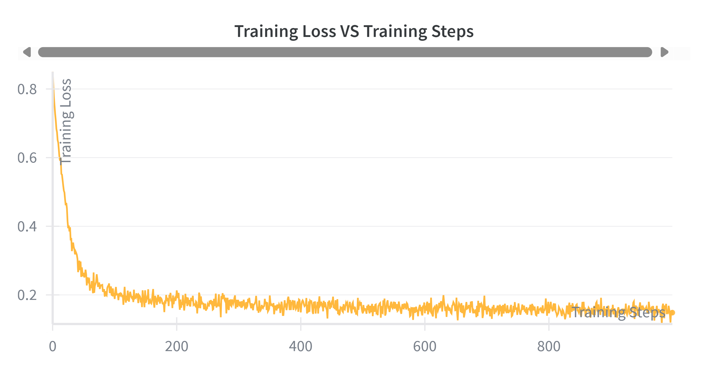
- FID curve: 
  - @1k steps
    
    - 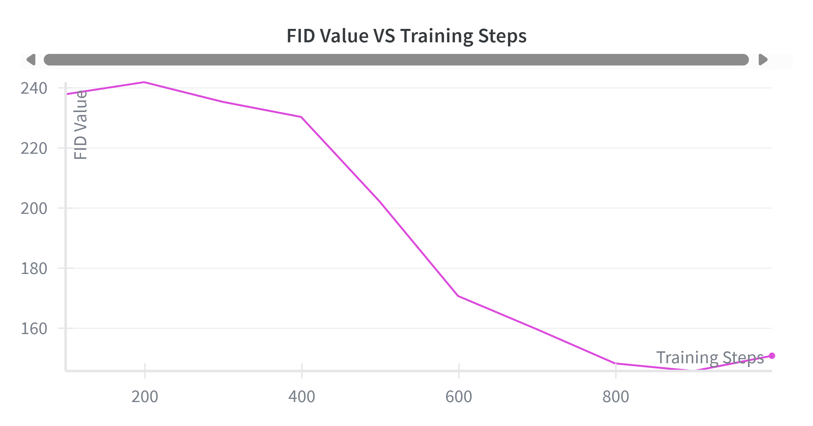
  - @10k steps

    - 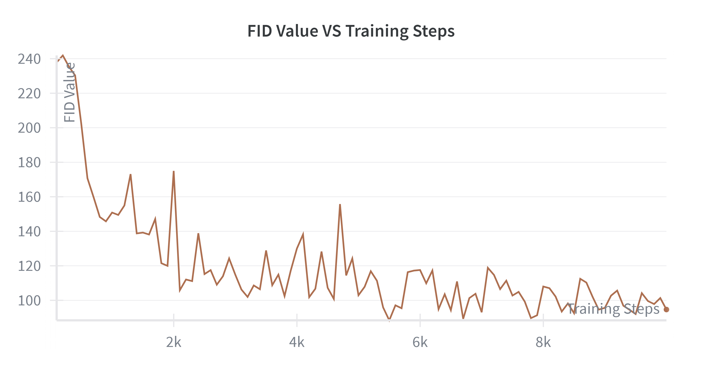
- Samples @1k steps: FID = 150.85

  - 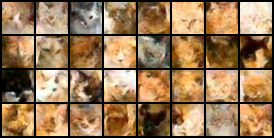
- Samples @10k steps: FID = 94.66

  - 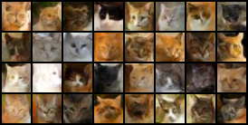
- Forward process:
  - 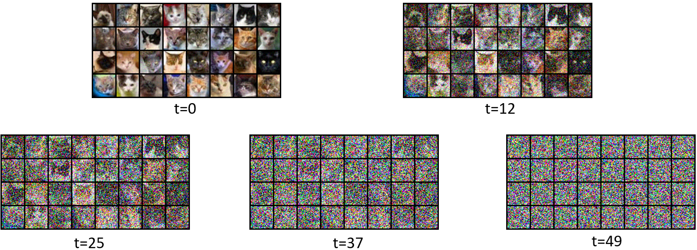
- Backward process:
  - 

---

## Project structure

```
.
├─ data/                         # dataset root (user-provided)
├─ results/                      # checkpoints, samples, visualizations
├─ main.py                       # CLI: train or visualize
├─ utils.py                      # W&B + trainer setup
├─ trainer.py                    # dataset, training loop, sampling, FID
├─ diffusion.py                  # schedules, q_sample, p_sample, sampling loop, loss
├─ unet.py                       # U-Net with attention
├─ requirements.txt
└─ README.md
```

---

## Reproducibility & tips

- Seeds set for determinism in `utils.py`.
- Keep jobs alive on remote with tmux:

```bash
tmux new -s ddpm "bash -lc 'source .venv/bin/activate && python main.py ... 2>&1 | tee -a train.log'"
# detach: Ctrl-b d    reattach: tmux a -t ddpm
```

- Monitor GPU: `watch -n 1 nvidia-smi`
- Resume: `--load_path ./results/<run>/model.pt`

---

## License & contact

MIT License  
Patrick Chen · Carnegie Mellon University  
bochunc@andrew.cmu.edu

---

## References

- Ho, Jain, Abbeel (2020) — Denoising Diffusion Probabilistic Models  
- Nichol, Dhariwal (2021) — Improved DDPM (cosine schedule)  
- `clean-fid` (FID) and AFHQ dataset
